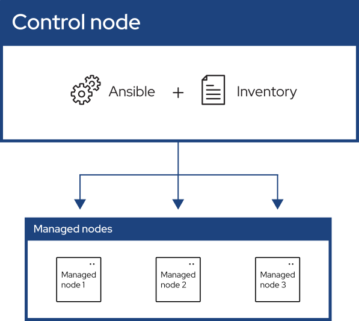

..
  Copyright (c) The Ansible project contributors.

  Documentation licensed under the GNU General Public License Version 3.
  The original work was translated from English into Brazilian Portuguese.
  https://github.com/ansible/ansible-documentation/blob/-/COPYING

  source_url: https://github.com/ansible/ansible-documentation/blob/devel/docs/docsite/rst/getting_started/index.rst
  revision: bd2ce70a0f3c74a6ee06a9e41e168fc0a03d2ff8
  status: ready

.. _getting_started_index:

#######################
Começando com o Ansible
#######################

O Ansible automatiza o gerenciamento de sistemas remotos e controla seu estado
desejado.

     controle, um inventário de nós gerenciados e um módulo copiado para cada nó
     gerenciado.

Como mostrado na figura anterior, a maioria dos ambientes Ansible possui três
componentes principais:

Nó de controle
  Um sistema no qual o Ansible está instalado.
  Você executa comandos do Ansible, como ``ansible`` ou ``ansible-inventory``,
  em um nó de controle.

Inventário
  Uma lista de nós gerenciados organizados logicamente.
  Você cria um inventário no nó de controle para descrever as implantações de
  hosts para o Ansible.

Nó gerenciado
  Um sistema remoto, ou host, que o Ansible controla.

.. toctree::
   :maxdepth: 1

   introduction
   get_started_ansible
   get_started_inventory
   get_started_playbook
   basic_concepts
